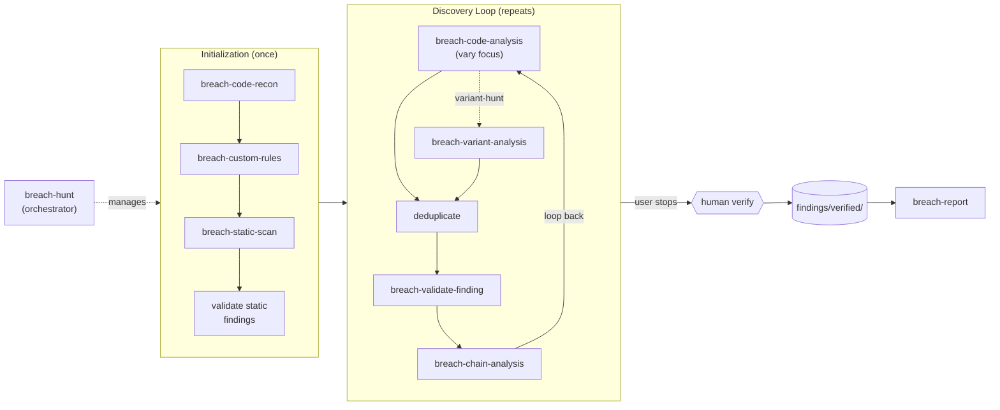

# breach-marketplace

Security-focused plugin marketplace for [Claude Code](https://docs.anthropic.com/en/docs/claude-code).

## Installation

Add the marketplace:

```
/plugin marketplace add tsheil/breach-marketplace
```

Install plugins:

```
/plugin install breach@breach-marketplace
```

## Available Plugins

| Plugin | Category | Description | Version |
|--------|----------|-------------|---------|
| [breach](plugins/breach/) | Core | Security vulnerability hunting toolkit | 1.7.0 |
| [hackerone](plugins/hackerone/) | Utility | HackerOne bug bounty platform integration | 0.1.0 |

## Core Plugins

### breach

Ten-skill pipeline for systematic source code security review with a filesystem-based finding lifecycle. Designed for expert security researchers and bug bounty hunters.



| Skill | Purpose |
|-------|---------|
| `breach-code-recon` | Attack surface mapping -- threat modeling, technology fingerprinting, entry points, trust boundaries, auth inventory, git history analysis |
| `breach-hunt` | Autonomous pipeline orchestrator -- initialization (code-recon → custom-rules → static-scan → validate), then continuous discovery loop (code-analysis with coverage-tracked focus and auto-shift → dedup → validate → chain-analysis), runs until user stops |
| `breach-custom-rules` | Codebase-specific rule generation -- analyzes code-recon output to generate custom Semgrep rules and CodeQL queries targeting application-specific patterns (auth decorators, homegrown sinks, framework behaviors, trust boundaries) |
| `breach-static-scan` | Automated scanning -- Semgrep pattern matching + CodeQL dataflow analysis, deterministic vulnerability detection, includes custom rulesets when present, runs once during initialization |
| `breach-code-analysis` | Vulnerability discovery -- OWASP Top 10 coverage, risk-prioritized analysis, vulnerability chaining, varies focus each loop iteration for non-deterministic coverage |
| `breach-findings` | Finding standards -- canonical reference for finding structure, naming, lifecycle stages, PoC standards, and directory layout |
| `breach-validate-finding` | Finding validation -- 4-phase 12-step procedure with anti-hallucination gates, footgun detection, triager analysis, 3x reproduction, deduplication |
| `breach-chain-analysis` | Chain discovery -- analyzes validated finding pairs for escalated impact, known chain patterns, adjacency analysis, chain severity calculation |
| `breach-variant-analysis` | Variant analysis -- extracts structural patterns from findings/CVEs/disclosures, generates targeted Semgrep/CodeQL rules, scans for variants across the codebase |
| `breach-report` | Report generation -- CVSS v3.1 scoring, reproduction steps, bounty-optimized presentation, hard gate on human-verified findings |

See [plugins/breach/README.md](plugins/breach/README.md) for full documentation.

## Utility Plugins

### hackerone

HackerOne bug bounty platform integration. Navigate programs, reports, hacktivity, and earnings via the HackerOne Hacker API.

**Requirements:** Python 3, HackerOne API credentials (username + API token).

| Skill | Purpose |
|-------|---------|
| `/hackerone` | Navigate HackerOne platform -- program research, report management, hacktivity intelligence, balance and earnings |

See [plugins/hackerone/README.md](plugins/hackerone/README.md) for full documentation.

## License

Apache-2.0. See [LICENSE](LICENSE).
